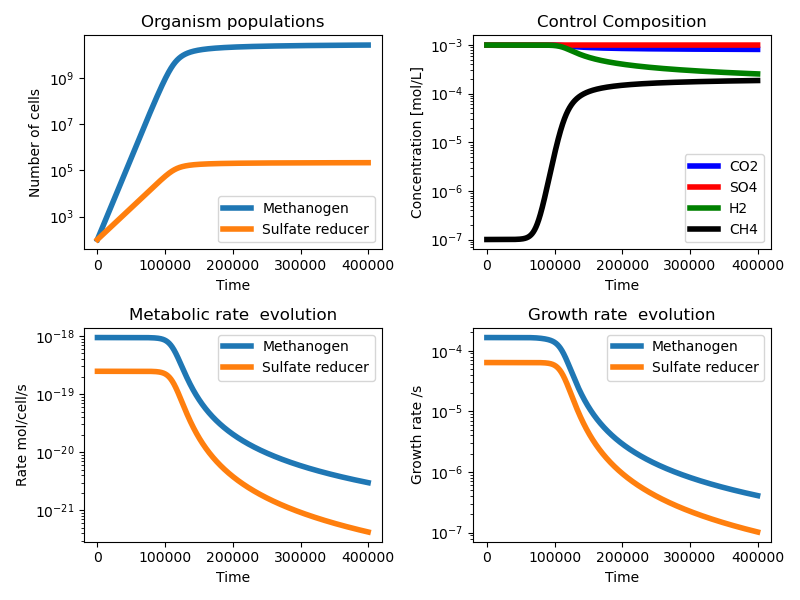

Simple microbial competition
============================

Below is an example code that will perform a simple time-integrated calculation
of microbial growth for a methanogen and sulfate reducer population initialised
in a similiar way as described on the last two pages.

..code::

  import NutMEG.core as nmc
  import NutMEG.models as nmm

  R = nmc.Reactor(pH=7)

  # introduce some reagents
  CO2 = nmc.Reagent('CO2(aq)', R, phase='aq', amount=(0.001, 'mol'))
  H2aq = nmc.Reagent('H2(aq)', R, phase='aq', amount=(0.001, 'mol'))
  CH4aq = nmc.Reagent('Methane(aq)', R, phase='g', amount=(1e-7, 'mol'))
  SO4 = nmc.Reagent('SO4-2', R, phase='aq', charge=-2, amount=(0.001, 'mol') )
  HS = nmc.Reagent('HS-', R, phase='aq', charge=-1, amount=(1e-7, 'mol'))
  H2O = nmc.Reagent('H2O(aq)', R, phase='l', activity=1.)

  # the overall reaction is CO2 + 4H2 -> CH4 + 2H2O
  thermalMG = nmc.Reaction(R, {'CO2(aq)':1, 'H2(aq)':4}, {'Methane(aq)':1, 'H2O(aq)':2})

  base_MG = nmc.BaseOrganism('Methanogen', thermalMG)
  # intialising a BaseOrganism like this is the bare minimum - and not enough for a
  # growth simulation. At the very least we need to tell it anticipated maximum
  # metabolic and growth rates.
  base_MG.metabolism.set_max_rate(nmm.base_rate_models.FirstOrderChemical(1e-3))
  base_MG.growth.set_max_rate(float('inf'))

  # Defined like this, the organism will perform its metabolic reaction
  # as if it had a first-order rate constant of 0.001, and grow as fast as
  # the metabolic kinetics allows.
  # Another concentration dependency can be added using a forcing factor.
  # Let's add a Monod dependency on H2:
  MG_Monod = nmm.forcing_factors.Monod('H2(aq)', 1e-5)
  base_MG.metabolism.forcing_factors.append(MG_Monod)

  # now let's make a community of methanogens numbering 1000
  Pop1 = nmc.OrgPop(base_MG, 100)

  # Next, create an organism that uses a different reaction - sulfate reducers
  # This time we'll plan it's rate dependencies first and set them on initialisation.
  SR_Monod = nmm.forcing_factors.Monod('H2(aq)', 1e-3) # more sensitive to H2 than methanogens
  SR_MetRate = nmm.base_rate_models.FirstOrderChemical(5e-4)
  SR_GroRate = nmm.base_rate_models.ConstantRate(float('inf'))

  # the overall reaction is 4H2 + SO4(2-) + H(+) -> HS(-) + 4H2O
  # but for this simple example we will omit the H+
  thermalSR = nmc.Reaction(R, {'H2(aq)':4, 'SO4-2':1}, {'HS-':1, 'H2O(aq)':4})

  # Finally, we can create the organism
  base_SR = nmc.BaseOrganism('SulfateReducer',
    nmc.org.Metaboliser(thermalSR, base_rate=SR_MetRate, forcing_factors=[SR_Monod, nmm.forcing_factors.Bioenergetic()]),
    growth = nmc.org.Grower(base_rate=SR_GroRate))

  # create an OrgPop of sulfate reducers
  Pop2 = nmc.OrgPop(base_SR, 100)

  # populate an ecosystem with the organisms and chemical environment.
  ES = nmc.Ecosystem(R, [Pop1, Pop2])

  # We will perform a time-integrated growth calculation using
  # the nmm.GrowthSimulation class. We need to tell it exactly what
  # outputs we are interested in monitoring through time, which we will do
  # with the outparams dictionary below.
  # try out adding output parameters!
  outparams = {
      'mol H2' : R.composition['H2(aq)'].get_amount,
      'mol CO2' : R.composition['CO2(aq)'].get_amount,
      'mol HS' : R.composition['HS-'].get_amount,
      'mol SO4' : R.composition['SO4-2'].get_amount,
      'mol CH4' : R.composition['Methane(aq)'].get_amount,
      'mol H' : R.composition['H+'].get_amount,
      'DG_MG' : Pop1.base.metabolism.net_pathway.get_molar_gibbs,
      'DG_SR' : Pop2.base.metabolism.net_pathway.get_molar_gibbs,
      'mu_MG' :Pop1.base.get_growth_rate,
      'mu_SR' :Pop2.base.get_growth_rate,
      'k_MG' :Pop1.base.get_metabolic_rate,
      'k_SR' :Pop2.base.get_metabolic_rate,
  }

  GS = nmm.GrowthSimulation(ES, resultsdict=outparams)

  # evolve the system for 4e5 seconds using a time-step of 100 seconds.,
  # and return the requested parameters' variability.
  popdict = GS.run(100., 4e5)

If you plot the outputs, it should look like this:

