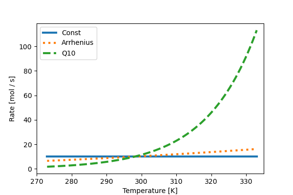

Base Rate Models
================

A :any:`BaseRateModel` computes the maximum rate to be used for a process, before other forcing mechanisms are applied. This can be as simple as a constant value through to any arbitrary user-defined rate function. NutMEG also has a few builtin options.

The snippet below creates four temperature-dependent BaseRateModels which have the same value at 298 K.

.. code::

    import NutMEG as nm
    import NutMEG.core as nmc
    import NutMEG.models as nmm

    R = nmc.Reactor()
    c = nmm.base_rate_models.ConstantRate(10.)
    a = nmm.base_rate_models.Arrhenius(A=1000., Ea=13462)
    q10 = nmm.base_rate_models.Q10(10., Q=2)

Below is how the rates manifest as a function of temperature:

.. note ::
  A BaseRateModel can be used as the rate function for anything --- not just for an organism's metabolic rate, but an abiotic reaction, a degradationor anything that changes through time and has a rate.
