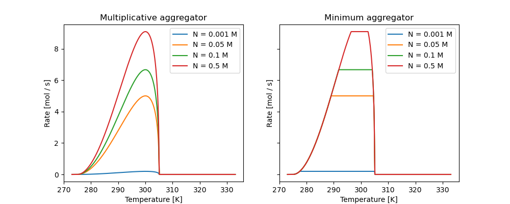

Rate Aggregators
================

NutMEG calculates microbial metabolic rates and growth rates by aggregating ForcingFactors and a BaseRateModel. One common aggregator is the multilicative model:

.. math::

  r = r_{max} \prod^i F_i

where :math:`F_i` are the forcing factors. Another common aggregator is Leibig's law of the minimum:

.. math::

  r = r_{max} \min( F_1, F_2, ... F_i)

The snippet below creates two forcing factors with a constant maximum base rete, then shows how these two aggregators can contribute to the metabolic rate of a BaseOrganism object:

the four temperature-dependent BaseRateModels which have the same value at 298 K.

.. code::

  import NutMEG as nm
  import NutMEG.core as nmc
  import NutMEG.models as nmm

  import numpy as np
  import matplotlib.pyplot as plt

  R = nmc.Reactor()
  nmc.Reagent('N', R, amount=(0.001, 'molal'), thermo=False)

  # assign a constant max rate.
  c = nmm.base_rate_models.ConstantRate(10.)

  # Make two forcing factors, one for T, one for N concentration:
  BP = nmm.forcing_factors.BiologicalPerformance('T', 300, 275, 305, 2.)
  M = nmm.forcing_factors.Monod('N', 0.05)

  Agg = nmm.aggregators.Multiplicative()
  Agg1 = nmm.aggregators.LeibigMinimum()

  # initialise a BaseOrganism with these forcing factors
  org = nmc.BaseOrganism(
    'organism',
    nmc.org.Metaboliser(None, base_rate=c, forcing_factors={'BioPerf':BP, 'Monod':M}))

  fig, axs = plt.subplots(ncols=2, figsize=(10,4), sharey=True)

  Ns = [0.001, 0.05, 0.1, 0.5] # N concentrations
  Ts = np.linspace(273, 333, num=500) # temperature range

  for i, A in enumerate([Agg, Agg1]):
      # Assign the organism's metabolic aggregator
      org.metabolism.aggregator = A
      for N in Ns:
          R.composition['N'].update_amount(R, mol=N) # set the N concentration
          rates = []
          for T in Ts:
              R.T = T # set the locale temperature
              # calculate the rate. this applies the aggregator.
              rates.append(org.metabolism.compute_rate(org, R))
          axs[i].plot(Ts, rates, label=f'N = {N} M')

Which results in the below plot:

.. note::

  Can't decide on an aggregator? No problem! It is possible to mix and match by being creative with your ForcingFactors.
