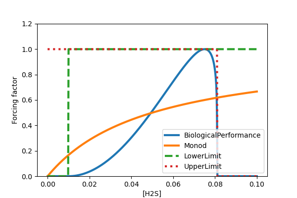

Rate forcing factors
====================

Forcing factors :math:`0 \geq F_{i} \leq 1` parameterise the offset from optimality a biological rate (e.g., metabolic rate or growth rate) experiences based on environmental conditions and organism specific constraints. In NutMEG they are computed using :any:`ForcingFactor` objects and several are stored in the NutMEG.models subpackage. They can be thought of as the fractional reduction in rate versus the maximum, for example:

.. math::

  F = \frac{r_{Fi}}{r_{max}}

Several functions can be proposed as a biological forcing factor, depending on the nature of the limitation. NutMEG allows any arbitrary child class of :any:`ForcingFactor` to be used, provided it has a compute() function. Users can thus define their own functions or make use of the numerous :doc:`built in options <../builtin_forcing_funcs>`.

The snippet below creates four ForcingFactors that each model the effect of a change in concentration of substrate/inhibitor H2S, which can inhibit when the concentration is too large, but for organbisms using it as a substrate, it also has a lower viability limit.

.. code::

  # all values chosen arbitrarily. For illustration only.
  import NutMEG as nm
  import NutMEG.core as nmc
  import NutMEG.models as nmm

  R = nmc.Reactor()
  nmc.Reagent('H2S', R, amount=(0.001, 'molal'), thermo=False)
  BP = nmm.forcing_factors.BiologicalPerformance('H2S', 0.075, 0.01, 0.081, 2.)
  M = nmm.forcing_factors.Monod('H2S', 0.05)
  LL = nmm.forcing_factors.LowerLimit('H2S', 0.01)
  UL = nmm.forcing_factors.UpperLimit('H2S', 0.081)

Below is how the forcing factors manifest as a function of H2S concentration:

