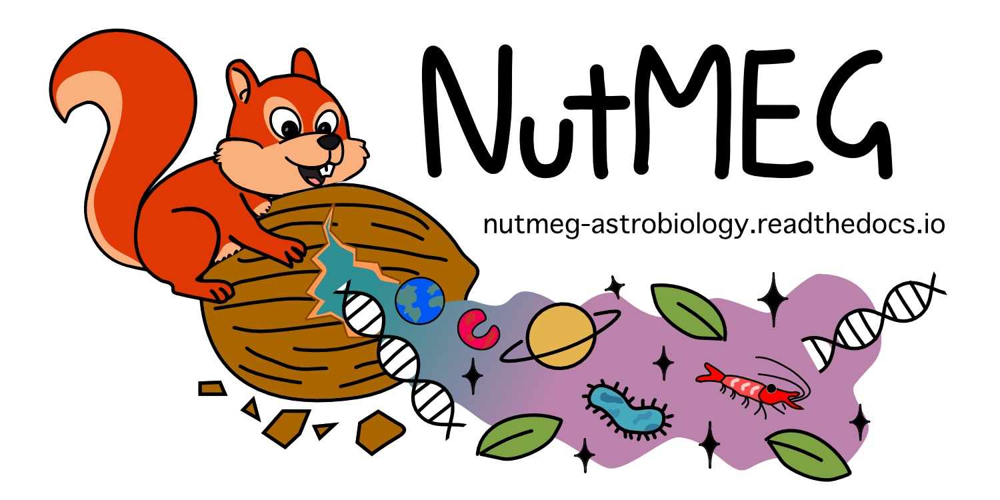
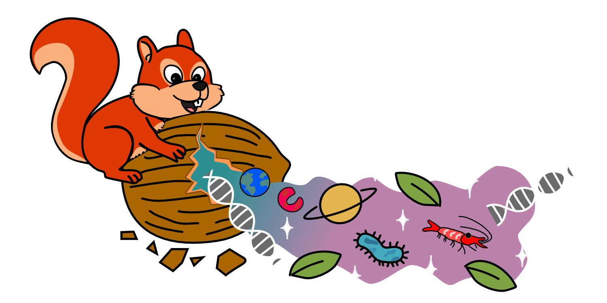

.. NutMEG documentation master file, created by
   sphinx-quickstart on Wed May 13 15:18:38 2020.
   You can adapt this file completely to your liking, but it should at least
   contain the root `toctree` directive.

.. important ::

  Lucky you, you're looking at the in-development NutMEG v2 documentation! v2 is mostly functional but isn't formally released yet. You can access the latest build of NutMEG v2 `here <https://github.com/pmhiggins/NutMEG/tree/nm_v2>`_. v2 is **not** backward compatible with v1. If you're working on a project using v1, please refer to the `v1 docs <https://higginsetal.com/docs/html/index.html>`_

*Nutrients, Maintenance, Energy and Growth*
-------------------------------------------

Welcome to the documentation for the NutMEG python package! `NutMEG <https://github.com/pmhiggins/NutMEG>`_ is designed for problems in biogeochemistry and astrobiology, where we know very little about the biology present---or if it even *is* present.

NutMEG began as a bioenergetic habitability and growth model for chemotrophy [1]_ [2]_, but is now able to be more flexible with metabolic strategies and use both thermodynamic and more abstract traditional growth models. It can also handle the evolution through time of any arbitrary phase, biotic or abiotic, for biosignature evaluation or evaluating biosphere-geosphere feedback on geologic scales.

As an academic project, NutMEG is forever a work-in-progress. We welcome community contributions, particularly for new presets to help standardise how we model different environments. Let us know if you use NutMEG for your project so we can highlight it in our list of NutMEG projects!

.. toctree::
    :maxdepth: 1
    :caption: Getting started

    guides/installation
    guides/coreframework
    guides/coreconcept
    api/index

.. toctree::
    :maxdepth: 1
    :caption: Examples & Tutorials

    guides/creating_reactor
    guides/creating_organism
    guides/creating_ecosystem
    guides/competition_example
    guides/monod_example
    guides/presets
    guides/citing_nutmeg
    guides/nutmeg_publications

* :ref:`genindex`
* :ref:`modindex`
* :ref:`search`

-----

.. [1]  Higgins & Cockell (2020), *J. R. Soc. Interface* doi: `10.1098/rsif.2020.0588 <hhttps://doi.org/10.1098/rsif.2020.0588>`_,
.. [2] Higgins (2022) *University of Edinburgh*; doi: `10.7488/era/2078 <http://dx.doi.org/10.7488/era/2078>`_,
